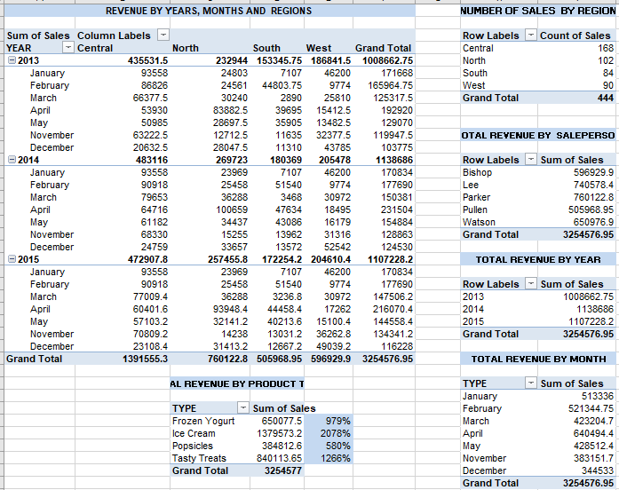
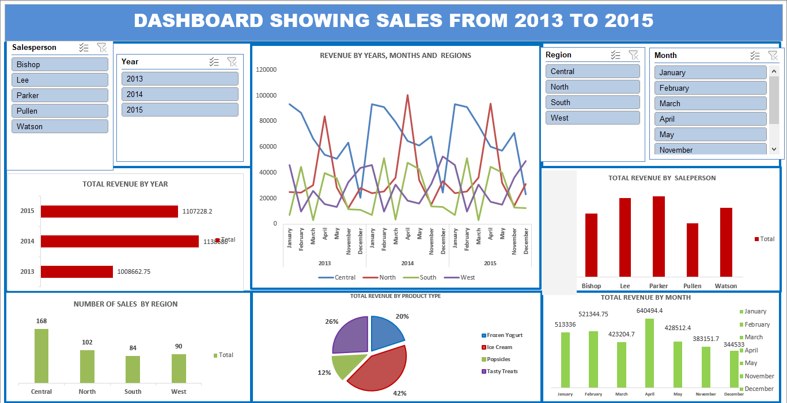

# Analysis-of-Sales-in-different-regions-from-2013-to-2015

## TABLE OF CONTENT

- [Introduction](#Introduction)

- [Data Description](#Data-Description)

- [Data Analysis](#Data-Analysis)

- [Skills demonstrated](#Skills-demonstrated)

- [Visualizations](#Visualizations)

- [Insight from analysis](#Insight-from-analysis)

- [Summary of Analysis](#Summary-of-Analysis)

## Introduction
The dataset captures detailed sales records of Cold treat products like ice cream, frozen yogurt, popsicles, tasty treats across various four regions (East, West North, South) and time periods between 2013 and 2015.
For every entry, information is provided on the month and year, salesperson, product type, region, number of units sold, and total sales amount.

This data provides an opportunity to analyze sales trends, understand customer preferences, evaluate sales performance across regions and personnel, and uncover seasonal patterns in consumer demand. By examining these insights, businesses can make informed decisions on marketing strategies, inventory management, and resource allocation to improve overall performance and profitability in the frozen dessert market.
## Data Description: 
The dataset comprises detailed transaction records from three coffee shops over a specified period. The data includes the following columns: 
•	Year: The calendar year in which the transaction occurred (e.g., 2013, 2014, 2015).
•	Month: The Month when the transaction took place. 
•	Type: The category of frozen dessert sold (e.g., Ice Cream, Popsicle, Frozen Yogurt) 
•	Salesperson: The quantity of items purchased in the transaction. 
•	Region: The geographical area where the sale was made (e.g., East, West, Central).
•	Sales: The total sales amount in currency generated from the transaction.
•	Units: The quantity of dessert items sold. 
•	Order: A unique identifier for each transaction/order.
This dataset provides a detailed record of sales transactions for frozen desserts across various regions. The data spans multiple years and is organized into key columns that help track and analyze performance over time. The Region column indicates the geographical area of the transaction, which is useful for identifying market strengths and weaknesses across territories. Two quantitative measures are included:
•	Sales, representing the monetary value of each transaction, and
•	Units, indicating the number of items sold.
the Order acts as a unique identifier for each transaction, ensuring that records can be traced and validated. 
Overall, this structured dataset supports both high-level sales reporting and detailed drill-down analysis, making it valuable for strategic decision-making in sales and marketing efforts.

## Data Collection and Preparation 
Raw Data Sheet: Include the raw data as a separate sheet. Label it clearly as "Raw Data 
Tools used: Excel

## Skills demonstrated
1. Data Cleaning, Preparation  and Transformation:
   (a)  It was formatted as table-
•	Click on home tab
•	Click format a table, under styles
•	A dialog box will appear, then click ok.
  (b). Ignoring errors on column F (sales) and column H (unit) 
•	Highlight the column F by holding the ctrl and the shift key and press the down arrow button.
•	A little dialog box will appear, click on it 
•	Then click on ignore error.
•	Repeat the same process on column H to clear off the Ignore

   (c) Data analysis

   (d) Data visualization 
  
    (e)Dashboard development 
 
    (f) Insight Generation 

Data Analysis:
•	The following pivot tables and chat were created:
I.	Revenue by years, months and regions
II.	Number of sales sold by region
III.	Total revenue by salesperson
IV.	Total revenue by year
V.	Total revenue by product type
VI.	Total revenue by month

## Visualizations:
A comprehensive dashboard was developed by gathering the pivot charts to allow for interactive insight to Sales company
Slicer Application: Slicers were added via insert > Slicers allowing dynamic filtering by fields such as Year, Month, Salesperson, product type and Region. 

## Insight from analysis:
1. Sales Performance by Product Type: Popsicles had the lowest sales volume, possibly indicating less demand or fewer promotions
2. Regional Performance: South had some strong months, particularly during warmer seasons (e.g., July–August), hinting at climate-based preferences.
3. Salesperson Analysis: Bishop led in most Ice Cream and Tasty Treat orders.
4. Monthly Trends: December showed a spike for Tasty Treats, likely due to the festive season.
5. Yearly Growth: From 2013 to 2015, there was a slight increase in total sales and units sold, indicating growth.
   
## Summary of Analysis
This dataset covers sales transactions from 2013 to 2015, detailing product types, regions, salespersons, units sold, and sales revenue. The goal was to uncover performance trends, product preferences, seasonal patterns, and regional variations.
Conclusion
The data reveals that product demand is seasonal and region-dependent, with Ice Cream driving the highest revenue. Targeted strategies focusing on top-performing regions and salespeople, coupled with seasonal promotions, can boost overall performance. To sustain growth, it's important to analyze low-performing months and products for improvement opportunities.
